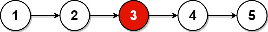

# Linked List Cycle

### Rule of Thumb for Detecting Linked List Cycle

A common rule of thumb for detecting a cycle in a linked list is **Floyd's Cycle-Finding Algorithm**, also known as the **Tortoise and Hare Algorithm**. This algorithm uses two pointers to traverse the linked list at different speeds:

- **Tortoise** (slow pointer) moves one step at a time.
- **Hare** (fast pointer) moves two steps at a time.

### Steps for detecting a cycle:

1. **Initialize two pointers**: 
   - The `slow` pointer starts at the head and moves one step at a time.
   - The `fast` pointer also starts at the head and moves two steps at a time.
   
2. **Traverse the list**:
   - While the `fast` pointer and `fast.next` are not `null` (to avoid going out of bounds), continue moving both pointers.
   
3. **Check for a cycle**:
   - If there is a cycle, at some point, the `fast` pointer will meet the `slow` pointer because the fast pointer is moving at twice the speed of the slow pointer.
   
4. **No cycle**:
   - If the `fast` pointer reaches the end of the list (i.e., `fast` or `fast.next` is `null`), the list has no cycle.

### Why it works:

- If a cycle exists, the fast pointer will eventually loop around and meet the slow pointer. The reason is that the fast pointer is moving at twice the speed of the slow pointer, so it will eventually "lap" the slow pointer inside the cycle.
  
- If no cycle exists, the fast pointer will reach the end of the list, and there will be no point where the fast and slow pointers meet.

---

# Middle of the Linked List

### **Problem:**
Given the head of a singly linked list, return the middle node of the linked list. If there are two middle nodes (even length linked list), return the second middle node.



Given the list: `1 -> 2 -> 3 -> 4 -> 5`, The middle node of the list is node `3`.


Given the list: `1 -> 2 -> 3 -> 4 -> 5 -> 6`, The middle node of the list is node `4`.

---

### **Code Explanation**:

```python
class ListNode:
    def __init__(self, val=None, next=None):
        self.val = val
        self.next = next

class Solution:
    def middleNode(self, head):
        fast = head
        slow = head
      
        while fast and fast.next:
            slow = slow.next
            fast = fast.next.next
      
return slow.val
```

---

# Linked List Cycle

### **Problem:**
Given `head`, the head of a linked list, determine if the linked list has a cycle in it.

There is a cycle in a linked list if there is some node in the list that can be reached again by continuously following the next pointer. Return true if there is a cycle in the linked list. Otherwise, return false.


---

### **Code Explanation**:

```python
class ListNode:
    def __init__(self, val=None, next=None):
        self.val = val
        self.next = next

class Solution:
   def hasCycle(self, head):
       # Create a dummy node to simplify edge case handling (e.g., empty list)
       dummy = ListNode(None)
       dummy.next = head
   
       # Initialize two pointers: slow (moves one step at a time) and fast (moves two steps at a time)
       slow = dummy
       fast = dummy
   
       # Traverse the linked list using two pointers to detect if there's a cycle
       while fast and fast.next:
           slow = slow.next          # Move slow pointer one step at a time
           fast = fast.next.next     # Move fast pointer two steps at a time
   
           # If slow and fast pointers meet, a cycle is detected
           if slow == fast:
               return True  # Return True if a cycle is found
   
       # If the loop terminates without detecting a cycle, return False
       return False
```

---

#  Linked List Cycle II (Find Cycle Start)

### **Problem:**
Given the head of a linked list, return the node where the cycle begins. If there is no cycle, return null.

There is a cycle in a linked list if there is some node in the list that can be reached again by continuously following the next pointer. Internally, pos is used to denote the index of the node that tail's next pointer is connected to (0-indexed). It is -1 if there is no cycle.


Given the list: `3 -> 2 -> 0 -> -4 -> 2`, There is a cycle in the linked list, where tail connects to the second node.

---

### **Code Explanation**:

```python
class ListNode:
    def __init__(self, val=None, next=None):
        self.val = val
        self.next = next

class Solution:
   def detectCycle(self, head):
       # Create a dummy node to simplify edge case handling (e.g., empty list)
       dummy = ListNode(None)
       dummy.next = head
   
       # Initialize two pointers: slow (moves one step at a time) and fast (moves two steps at a time)
       slow = head
       fast = head
   
       # Traverse the linked list using two pointers to detect if there's a cycle
       while fast and fast.next:
           slow = slow.next          # Move slow pointer one step at a time
           fast = fast.next.next     # Move fast pointer two steps at a time
   
           # If slow and fast pointers meet, a cycle is detected
           if slow == fast:
               break
       else:
           # If the loop terminates without detecting a cycle, return None
           return None
   
       # Reset p1 to the head of the list and p2 to the slow pointer
       p1 = head
       p2 = slow
   
       # Move both pointers one step at a time until they meet at the start of the cycle
       while p1 != p2:
           p1 = p1.next
           p2 = p2.next
   
       # Return the node where the cycle begins
       return p1
```

---

# Remove Loop from Linked List

### **Problem:**
Given the head of a linked list, The goal is to find out the exact point where you first started walking in this loop, and then you want to break the loop by not going in the circle just before this point.


Given a linked list: `3 -> 2 -> 0 -> -4 -> 2`, where there is a cycle in the list (the last node points back to one of the earlier nodes), the output should be the list with the cycle removed, looks like `3 -> 2 -> 0 -> -4 -> null`.

---

### **Code Explanation**:

```python
class ListNode:
    def __init__(self, val=None, next=None):
        self.val = val
        self.next = next

class Solution:
    def removeCycle(self, A):
        # Create a dummy node to simplify edge case handling (e.g., empty list)
        dummy = ListNode(None)
        dummy.next = A # Link the dummy node to the head of the list

        # Initialize three pointers:
        # slow (moves one step at a time), fast (moves two steps at a time), and prev (tracks the node before slow)
        slow = A
        fast = A
        prev = dummy
        
        # Traverse the linked list using the slow and fast pointers to detect if there's a cycle    
        while fast and fast.next:
            prev = prev.next
            slow = slow.next
            fast = fast.next.next

            # If slow and fast pointers meet, a cycle is detected
            if slow == fast:            
                break
        else:
            # If the loop terminates without detecting a cycle, return None (no cycle in the list)
            return None
    
        # Reset p1 to the head of the list and p2 to the slow pointer to find the cycle's start point
        p1 = A
        p2 = slow

        # Move both pointers one step at a time until they meet at the start of the cycle
        while p1 != p2:
            p1 = p1.next
            p2 = p2.next  
            prev = prev.next # Move prev to the node before the current node in the cycle

        # Disconnect the cycle by setting the 'next' pointer of the node before the cycle's start to None
        prev.next = None
        
        # Return the modified list, with the cycle removed
        return dummy.next
```

---